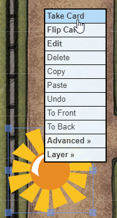
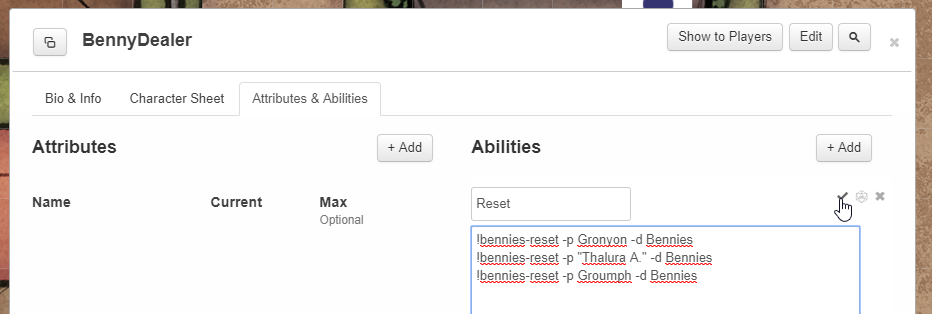

# BenniesScript
Roll20 script to ease dealing Savage Worlds Bennies to players. You can also use it to grant Conviction, count Mass Battle tokens, or keep track of Social Conflict Influence.

## Setup
### API Scripts
You need a Roll20 Pro Subscription to be able to use API Scripts.

You need to install two scripts:
* apicmd.js that you can find [apicmd GitHub](https://gist.github.com/goblinHordes/7424738)
* this SWBennies.js script from [Gronyon's GitHub](https://github.com/gronyon/BenniesScript)

apicmd is used to parse the BenniesScript input (why reinvent the wheel when it has already been created and nicely round ?).

### Benny deck
You also need to create a Deck of "cards" for your bennies, in your Roll20 game.
* Name of the deck: it will appear in your players hand of cards and will also be used in this script API commands. Something like "Bennies" should do.
* Set the Deck to unlimited.


* Create one card, give it a name. This name can be used in the API (see below).
* Upload a visual for your card and the deck background. I personnaly use the same image.


If you are playing Deadlands or similar settings with different types/colors of bennies, check [Advanced Usage > Multi-bennies](#deadlands-multi-colors-bennies).

## API Commands
### Deal benny to a player
Give a single benny to a player:
```javascript
!bennies-deal --player PlayerDisplayName --deck NameOfTheBennyDeck
```


If player display name contain spaces or special characters, use quotes (same for your bennies deck name if needed):
```javascript
!bennies-deal --player "A player name" --deck "Wonderful Bennies of Awesome"
```
(you can also use player IDs instead, see [Advanced usage](#advanced-usage) below)

Give multiple bennies to a single player:
```javascript
!bennies-deal --player PlayerDisplayName --deck NameOfTheBennyDeck --quantity 4
```


And you can shorten it all:
```javascript
!bennies-deal -p PlayerDisplayName -d NameOfTheBennyDeck -q 2
```

If you don't provide a player name, the command will list all online players and let you pick one:
```javascript
!bennies-deal -d NameOfTheBennyDeck
```


### Deal benny to every player
Sometimes you want to reward each player (but not GMs) with a benny, for example when a Joker was drawn. Use "all" for the player name.
```javascript
!bennies-deal --player all --deck NameOfTheBennyDeck
```

You could also grant multiple bennies to each player:
```javascript
!bennies-deal -p all -deck NameOfTheBennyDeck -q 3
```

### Use benny
No need to use script api here. Players will simply drag and drop their benny card on the table.


If that was a mistake, they can simply pick it back.



If it wasn't, Game Master can simply delete the benny from the table.


### Reseting bennies at the start of a game
At the start of each session, you want to refill each player to its standard starting pool.

Reset a player's bennies back to three:
```javascript
!bennies-reset -p PlayerDisplayName -d NameOfTheBennyDeck
```

Taking Luck and similar Edges into account by specifying the target quantity:
```javascript
!bennies-reset -p PlayerDisplayName -d NameOfTheBennyDeck -q 4
```

However, if you want to put them into a single macro, some lines in the macro often get lost, and you might want to put everything on a single command. Use the --multi option to deal to all players in a single go. Player names (or ids) are comma separated.

```javascript
!bennies-reset --deck NameOfTheBennyDeck --multi FirstPlayer,SecondPlayer,ThirdPlayer
```

Quantity (for Luck or similar Edges) can be added with a pipe | character:
```javascript
!bennies-reset -d Bennies -m Gronyon,Kayla|4,Voronwë
```
Would deal 3 bennies to Gronyon and Voronwë, but 4 to Kayla.


## Advanced usage
### Using player IDs
Instead of giving bennies to a player by their name (and having your macro fail each time a player change their display name), you can use her ID:
```javascript
!bennies-deal -p "-L8nrK8CDBqUbROE_YvW" -d NameOfTheBennyDeck
```
Note that you must use quotes around the id, to avoid the leading hyphen of Roll20 Id to be identified as an option to the command line.

You get the IDs of the players with:
```javascript
!bennies-show --ids
```

### Setting up macros
You can create macro so you don't have to type the commands each time:


And add it to your macro bar. However, it becomes quickly overloaded.

Using UTF-8 characters for macro names, you can make macro bar way shorter. You can find such icons on sites like [utf8icons](https://www.utf8icons.com/subsets/miscellaneous-symbols-and-pictographs/100) or [emojipedia](https://emojipedia.org/). For example, here I used a "cookie" for the macro name:


This will nicely display in your macro bar:


### Using a Macro Character Sheet
To save macro bar space and for macro you don't need that often, create a character sheet, and set the macros in the abilities section.



Have each ability display in the Token Action bar. Set the most often used to display on your Macro Bar.

Put a token of this character somewhere on your game table and you can roll your macros from the token bar.


The Macro Character Sheet is also a good way to copy macros from game to game (using the Character Transmogrifier).

### Deadlands multi-colors bennies
If your game is using different types (or colors) of bennies (like in Deadlands, Savage Eberron), set up multiple cards in your benny deck.

Set up a single deck but
* add as many cards as you want
* each card may have its own art and name
* create multiple times the same card (typically 20 white, 10 red, 5 blue in a Deadlands game)
* do not set the deck as infinite


Using deal and reset commands, cards are picked at random:
```javascript
!bennies-deal -p Dude -d Deadlands
!bennies-reset -d Dealands -m Dude,Pedro,Doc,Fanny
```

To deal a specific benny to a player, add --card argument:
```javascript
!bennies-deal -p Dude -d Deadlands -c Royal
```

All bennies appear in the same section in the player's hand:


### Special bennies
If some settings, a player can be dealt a special benny which can only be used in given situations, like Can only be used while Berserk, Can only be given through Animal Bond (SWAG Companions & Familiars Kin Bond Edge), Must be used during the current scene (SWAG Bards & Minstrel Fortune power).

You can set one deck per benny type.

Deal special bennies using their deck name:
```javascript
!bennies-deal -p Linda -d Royal
```

Bennies will appear in separate sections in the player's hand:


Alternatively, you can create each benny type as a different card in a single deck:


Deal special bennies using the --card option:
```javascript
!bennies-deal -p Linda -d Bennies -c Royal
```

Bennies appear in the same section in the player's hand:


### Conviction
To use Conviction Setting Rule, create a "Benny Deck", call it "Conviction".
```javascript
!bennies-deal -p Gerald -d Conviction
```

### Dramatic Tasks, Social Conflicts, and Mass Battles
Those Savage Worlds modules use tokens to track progress.

Create a "Benny Deck", add a single card "Token".
Choose a player as "captain". Deal that player all tokens gained by the players:
```javascript
!bennies-deal -p Gerald -d Token
```

For tokens gained by the opposition (e.g. in Social Conflicts), deal them to you, the GM.
```javascript
!bennies-deal -p Gronyon -d Token
```

For token lost (e.g. in a Mass Battle), no API yet, simply have the player drop tokens from his hand to the board.


When it's over, no need for API, simply recall all tokens back to the deck:
 

If you want different art for each type of token, follow exemple in the [Special Bennies](#special-bennies) section.

### Quickly create custom benny art
You are in a hurry? You need some Art for Bennies and Tokens very fast?
* [TokenStamp](http://rolladvantage.com/tokenstamp/) let you quickly get a colored circle
* Drag an image 
* Or add a text box 
* Use UTF-8 characters ([utf8icons](https://www.utf8icons.com/) or [emojipedia](https://emojipedia.org/) in that text box for quick images 
