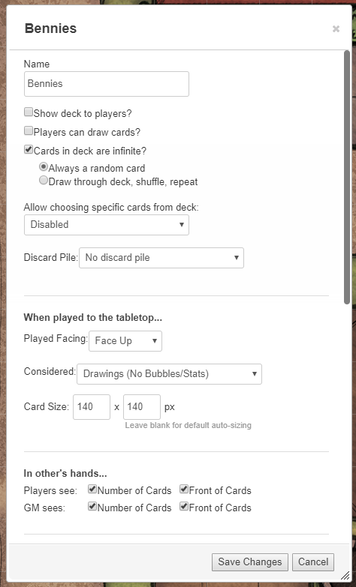
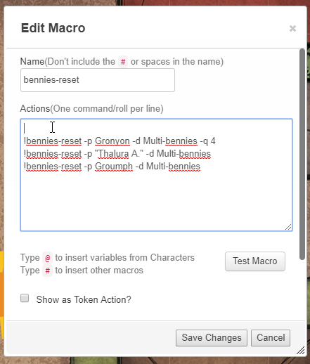

# BenniesScript
Roll20 script to ease dealing Savage Worlds Bennies to players.

## Setup
You need a Roll20 Pro Subscription to be able to use API Scripts.

You will need to install two scripts :
* apicmd.js that you can find [apicmd GitHub](https://gist.github.com/goblinHordes/7424738)
* this Bennies.js script from [Gronyon's GitHub](https://github.com/gronyon/BenniesScript)

apicmd is used to parse the BenniesScript input (why reinvent the wheel when it has already been created and nicely round ?).

You will also need to create a Deck of "cards" for your bennies, in your Roll20 game.
* Name of the deck : it will appear in your players hand of cards and will also be used in this script API commands. Something like "Bennies" should do.
* Set the Deck to unlimited.



* Create one card, give it a name. This name can be used in the API (see below).
* Uploade a visual for your card and the deck background. I personnaly use the same image.


## API Commands
### Dealing bennies to a player
This will give a single benny to the given player :
```javascript
!bennies-deal --player PlayerDisplayName --deck NameOfTheBennyDeck
```


If player display name contain spaces or special characters, use quotes (same for your bennies deck name if needed) :
```javascript
!bennies-deal --player "A player name" --deck "Wonderful Bennies of Awesome"
```

If you ever need to give more than one benny to a player :
```javascript
!bennies-deal --player PlayerDisplayName --deck NameOfTheBennyDeck --quantity 4
```


And you can short it all :
```javascript
!bennies-deal -p PlayerDisplayName -d NameOfTheBennyDeck -q 2
```

If you don't provide a player name, the commande will list all players and let you pick one :
```javascript
!bennies-deal -d NameOfTheBennyDeck
```


### Using bennies (players)
No need to use script api here. Players will simply drag and drop their benny card on the table.


If that was a mistake, they can simply pick it back.


If it wasn't, Game Master can simply delete the benny from the table.


### Reseting bennies at the start of a game
At the start of each session, you want to refill each player to its standard starting pool.

You can use the reset command, which syntax looks exactly as the deal command, but it will reset to the given quantity instead of adding.
```javascript
!bennies-reset -p PlayerDisplayName -d NameOfTheBennyDeck
```
Bennies will be reset to 3.

If player has Luck or similary Edge, you can set the quantity :
```javascript
!bennies-reset -p PlayerDisplayName -d NameOfTheBennyDeck -q 4
```


## Setting up macros

You can of course create macro so you don't have to type the commands each time :



You can add this macro to your macro bar. However macro bar becomes quickly overburdained.

Create a fake character, e.g. named "Benny Dealer" and have her Abilities to store the macros. 


Have each ability display in the Token Action bar.

Put a token of this character somewhere hidden on your game table, and you can roll your macros from the token bar.


## Handling different type of bennies
If your game is using different types of bennies (like in Deadlands), for example, a Classic benny that can reroll a trait, a Soak benny that can only soak wounds, and a royal benny that can be used for both, you can use a different deck for each type of benny, and change the Deck name in the command.
```javascript
!bennies-deal -p PlayerDisplayName -d Royal 
```

Those bennies will appear in separate sections (one per Deck) in the player's hand :


Or you can put all bennies as different cards in the same unique deck. Each card must have a different name.


You can then deal a specific benny to a player by adding a --card argument :
```javascript
!bennies-deal -p Dude -d Bennies --card Royal
```

Bennies will all appear in the same section :


To reset bennies, you will have to specify each type of benny for each player :
```javascript
!bennies-reset -p Dude -d Bennies --card Classic --quantity 3
!bennies-reset -p Dude -d Bennies --card Soak --quantity 1
!bennies-reset -p Dude -d Bennies --card Royal --quantity 0
```

